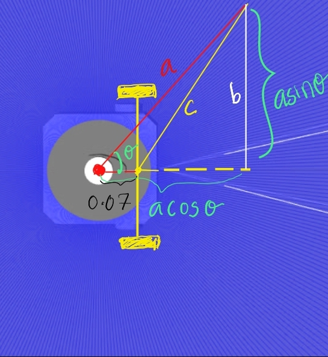

# Challenge 0

Find out the minimal distance to the walls.

## Key concepts

**Nodes** 
- Nodes are basic building blocks  in Ros2 , help to make everything modular.

- Each node can perform specific task

- Nodes can communicates by sending and receiving messages over Topics, services and parameters. 

**Topics**

- A Mechanism for a asynchronous communication between nodes

- Nodes can publish and subscribe to a topic

- Multiple nodes can publish and subscribe to same topic simultaneously.

- In this we are using one node `Tb3`, one topic subscribed  `scan` ( for LiDAR ) and one topic published `cmd_vel` ( for giving velocity to actuators). Subscribed message type is `LaserScan` and published message type is `Twist`.

**LiDAR** 
- Light detection and ranging, a method for gauging distances, involves directing a laser towards an object or surface and calculating the duration it takes for the reflected light to return to the sensor.

## Approach

I got the minimal distance to the wall using two ways.

**First approach :**  Run the python program `tb3.py`. It will generate the minimum distance to the each direction of the wall.

**Second approach :** From the Topic visualization selecting the scan topic in the gazebo 

## Result

The minimal distance to each walls are 0.5474, 0.3583, 0.4932, 0.459. 

## Challenges faced 
- Initially, I was using Foxy Fitzroy (Distribution version of ROS2). To update it to Humble Hawksbill (New distribution version), I had to update my Ubuntu version to 22.04 ( Jammy Jellyfish).

##

# Challenge 1

Drive forward the robot near to the wall in front of robot without colliding. The movement should be smooth (both acceleration and the deceleration) 

## Key concepts

**The third equation** of motion is given by

Where:

- v is the final velocity of the object,
- u is the initial velocity of the object,
- a is the constant acceleration experienced by the object, and
- s is the displacement of the object.

## Approach

Primarily, we require two pieces of information:

1. The distance necessary for the robot to decelerate to a complete stop.
2. The distance between the robot and the wall ahead, obtained from Lidar data.

The formula used to calculate the distance required for deceleration is derived from:

Where:
- $v$ is the final velocity, which is 0 in this case.
- $u$ is the initial linear velocity, representing the current linear velocity of the robot.
- $a$ is the deceleration, the rate at which the robot slows down.
- $s$ is the distance needed to decelerate from the initial velocity to the final velocity.

- A padding distance will be added to the calculated distance; otherwise, the vehicle will stop at the same position as the wall.

The distance to the wall is obtained from Lidar data, which is collected in an array comprising nearly 360 values. To determine the distance ahead of the robot, we extract the value at the zeroth index of the array.

Due to potential fluctuations in Lidar data, it's essential to maintain consistency by calculating an average with the previous Lidar value.

## Algorithm
An if-else loop is utilized to manage the switching control between different states, such as acceleration, deceleration, and stopping velocity.

## Result
- The vehicle can be halted at the desired distance from the wall by adjusting the padding distance values.
 - Changes in velocity and deceleration will consequently change the distances required for acceleration and deceleration.

 
 

 - From the distance vs. time graph, it is evident that the fluctuations observed are attributed to the noise originating from the LiDAR data.

## Challenges faced

- The Lidar values exhibit fluctuations, resulting in the vehicle stopping at varying distances each time.

- The deceleration value wasn't proportional to the velocity provided because only a percentage of the velocity (2.6m/s) was being utilized. Therefore, when calculating distances, it's essential to map all values accordingly.

##
# Challenge 2

Robot should rotate 90 degree in a smooth movement using LiDAR data.

## Key concepts

**Nan values:** In computing, NaN , standing for Not a Number, is a particular value of a numeric data type (often a floating-point number) which is undefined as a number, such as the result of 0/0.

## Approach
- To measure the degree of rotation of the robot and stop it at a desired angle, we can utilize the initial LiDAR scan values (an array of 360-degree distance values) as a reference. By comparing subsequent LiDAR scans with the initial scan, we can determine how much the robot has rotated.

- Since the rotation of the robot occurs around its wheel axis rather than the LiDAR frame, we need to account for this difference in our calculations. We can use geometric relationships to translate the rotation measured in the LiDAR frame to the rotation around the wheel axis.

- To calculate the conversion from the LiDAR axis to the robot wheel axis, we need to consider the geometry of the robot and the LiDAR sensor. Let's denote:

- a  as the laser-scanned distance obtained from the LiDAR sensor.
- c as the calculated distance from the robot's wheel axis.

 - By continuously monitoring the LiDAR data and comparing it to the initial scan, we can track the rotation of the robot and stop it at the desired angle by adjusting its motion accordingly.

 - To achieve a 90-degree rotation, we must adjust the reference LiDAR scan array to reflect a 90-degree rotated configuration.

 

 - This is accomplished by rearranging the reference array so that values starting from index 90 of the original array become the new zeroth index of the desired array. By using this rearranged reference array as the rotation limit, we can turn the robot while simultaneously measuring values from the LiDAR.

 ## Algorithm

 

## Result

Successfully completed a 90-degree counter-clockwise rotation. Moreover, the ability to rotate to any desired angle has been achieved by simply adjusting a variable to the desired degree.

## Challenges faced

 - The initial approach, which involved checking the distance at a 90-degree angle from the LiDAR, failed due to the square geometry, as the check completed before the vehicle started turning.

- To address this issue, a delayed check method was implemented, but it proved unreliable. The current idea for turn checking relies on multiple LiDAR scan values.

- In a physical robot setup, the LiDAR scan intermittently returns NaN values, leading to erratic robot behavior. To mitigate this, NaN values are avoided, and the mean is calculated using the np.nanmean function.

- Additionally, the number of LiDAR scan array values received from the physical robot is not always 360; it varies. Therefore, angle calculations are adjusted accordingly. For example, to determine a 90-degree angle, we calculate the value corresponding to one-fourth of the total array length
##
# Challenge 3

Goal is to drive the robot 15cm forward then rotate 90 degree clockwise and then drive again 15cm ahead and stop at the end. we should only use the odometry sensor values for accomplishing the challenge.

## Key concepts

**Pose** 

Represents the position and orientation of an object, typically in three dimensions.

**Euler Angles and Quaternions**

 Both represent spatial rotations in three dimensions. Euler angles use successive planar rotation angles around x, y, and z axes, while quaternions encode axis-angle representation using four real numbers.

**State Machine** 

An abstract machine comprising states, input and output events, and a state transition function. It facilitates managing the behavior of systems by transitioning between states based on input events.

**Odometry**

 The use of data from motion sensors (such as rotary encoders) to estimate change in position over time. It helps robots determine their position relative to a starting location by measuring how far wheels or legged joints have rotated.

 ## Approach

 - To accomplish the task of driving the robot in three states (clockwise turn, forward movement, and vehicle at rest) in a sequential order (driving 15cm straight, taking a 90-degree right turn, and moving straight again for 15cm)
 - The odometry values were utilized to establish a reference frame for measuring changes in the vehicle's position and orientation (pose). The orientation, provided in Quaternion format, was converted to Euler format for clarity using the "euler_from_quaternion" function.

 - The distance traveled by the vehicle during forward movement was calculated using the Euclidean distance formula based on changes in the x and y coordinates of the position.

- Changes in the yaw angle (rotation over the z-axis) were used to measure the turn of the robot relative to the reference frame.

- The robot's forward movement was controlled to precisely 15cm by monitoring the current distance traveled and comparing it to the desired limit.
- Sequential movement was achieved by employing a state machine with three states: clockwise turn, forward movement, and vehicle at rest. After completing each state, the robot's initial frame was reset to the current frame, and the next state utilized this updated reference frame.

## Algorithm

## Result 
The movement pattern of the robot has been successfully executed.

## Challange faced
- The issue with the in-built function quat2euler, which produced errors in the Euler angle values, was addressed by implementing a custom function. This function numerically calculates and determines the roll, pitch, and yaw angles to ensure accurate results.

##
# Challenge 4

Goal is to drive to the right most corner of the maze from the bottom left corner. Mazes are in four patterns.

## Approach

- To tackle this challenge, we utilize both the Lidar scan values and odometry data. 
- The robot performs two main types of movements to navigate the maze, relying on odometry data as in previous challenges.

- The decision on which motion to choose is determined based on the Lidar scan values.

- In the above diagram, the yellow path represents the first type of motion, while the green path represents the second type of motion.

1. First motion:  Turn 90 degree right , moving forward for 110cm , turn 90 degree left, move forward for 110 cm and stop

2. second motion: Moving forward for 110cm , turn 90 degree right, move forward for 110 cm and stop.

- To solve the maze using Lidar values, the robot scans both the forward distance and a 30-degree angled distance to the right side. The robot is assumed to be placed in the bottom-left side of the maze.

- If any object is detected within a range of 130 cm using the Lidar data, the robot will choose the first path to solve the maze. Otherwise, it will choose the second path.

- A state machine is employed to manage the robot's motion, transitioning between states as needed for the appropriate actions.

## Algorithm

### First path

### Second path

## Result 
The movement pattern of the robot has been successfully executed.
Challenges have completed and this is my Git Repo:[Link](https://mygit.th-deg.de/sg27251/robot_ptogramming_ws2023.git)

## Challenges faced

- The use of a state machine became somewhat complex due to the multiple movements involved in navigating the maze.

- In a physical robot setup, Lidar values were inconsistent and varied depending on the robot's battery power. Additionally, errors in odometry values, particularly in orientation, were observed due to the malfunction of the compass inside the robot.

- To mitigate these issues, testing was conducted with multiple robots rather than relying on a single robot. This approach helped to address the variability in Lidar values and odometry errors.
