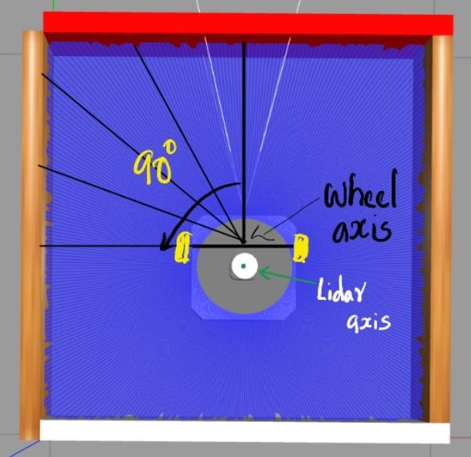
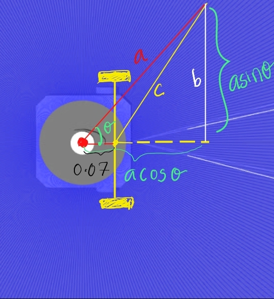
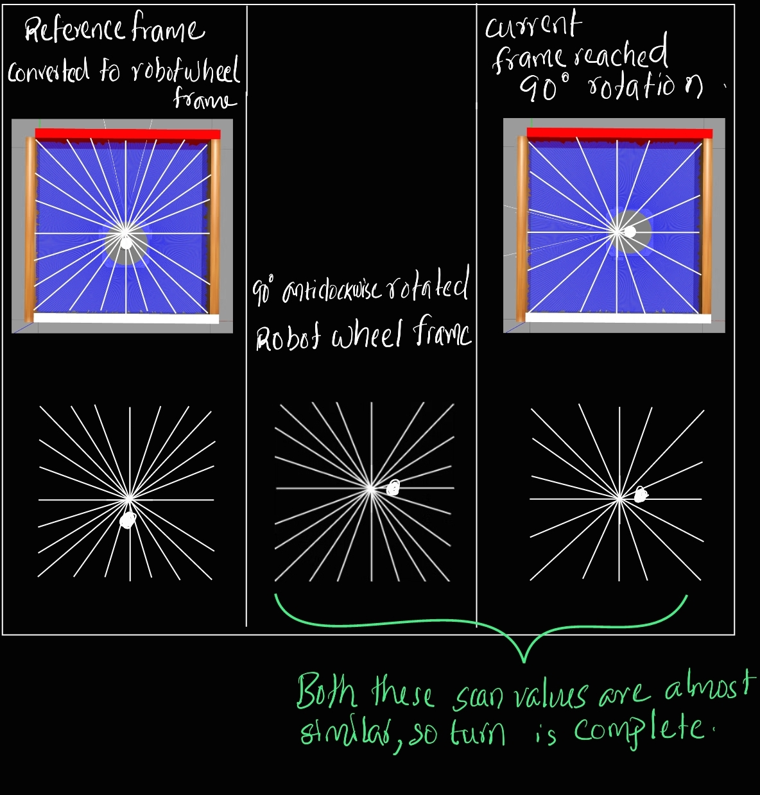
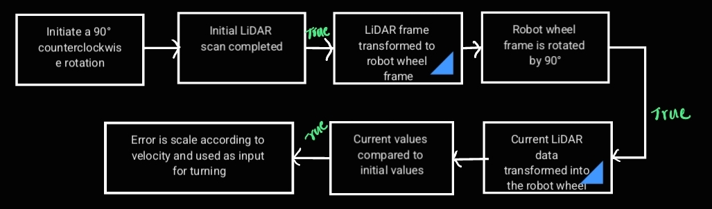

# Challenge 2

Robot should rotate 90 degree in a smooth movement using LiDAR data.

## Key concepts

**Nan values:** In computing, NaN , standing for Not a Number, is a particular value of a numeric data type (often a floating-point number) which is undefined as a number, such as the result of 0/0.

## Approach
- To measure the degree of rotation of the robot and stop it at a desired angle, we can utilize the initial LiDAR scan values (an array of 360-degree distance values) as a reference. By comparing subsequent LiDAR scans with the initial scan, we can determine how much the robot has rotated.

- Since the rotation of the robot occurs around its wheel axis rather than the LiDAR frame, we need to account for this difference in our calculations. We can use geometric relationships to translate the rotation measured in the LiDAR frame to the rotation around the wheel axis.

- To calculate the conversion from the LiDAR axis to the robot wheel axis, we need to consider the geometry of the robot and the LiDAR sensor. Let's denote:

- a  as the laser-scanned distance obtained from the LiDAR sensor.
- c as the calculated distance from the robot's wheel axis.

 - By continuously monitoring the LiDAR data and comparing it to the initial scan, we can track the rotation of the robot and stop it at the desired angle by adjusting its motion accordingly.

 - To achieve a 90-degree rotation, we must adjust the reference LiDAR scan array to reflect a 90-degree rotated configuration.

 

 - This is accomplished by rearranging the reference array so that values starting from index 90 of the original array become the new zeroth index of the desired array. By using this rearranged reference array as the rotation limit, we can turn the robot while simultaneously measuring values from the LiDAR.

 ## Algorithm

 

## Result

Successfully completed a 90-degree counter-clockwise rotation. Moreover, the ability to rotate to any desired angle has been achieved by simply adjusting a variable to the desired degree.

## Challenges faced

 - The initial approach, which involved checking the distance at a 90-degree angle from the LiDAR, failed due to the square geometry, as the check completed before the vehicle started turning.

- To address this issue, a delayed check method was implemented, but it proved unreliable. The current idea for turn checking relies on multiple LiDAR scan values.

- In a physical robot setup, the LiDAR scan intermittently returns NaN values, leading to erratic robot behavior. To mitigate this, NaN values are avoided, and the mean is calculated using the np.nanmean function.

- Additionally, the number of LiDAR scan array values received from the physical robot is not always 360; it varies. Therefore, angle calculations are adjusted accordingly. For example, to determine a 90-degree angle, we calculate the value corresponding to one-fourth of the total array length