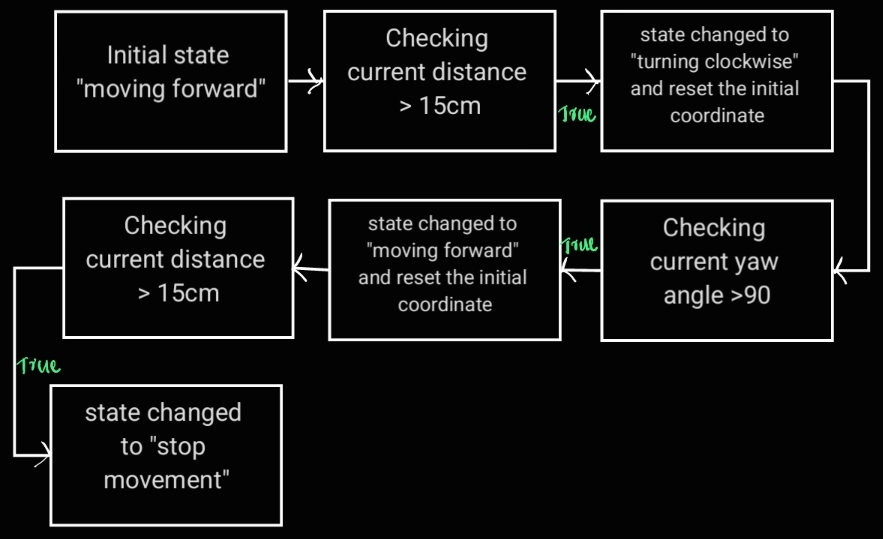

# Challenge 3

Goal is to drive the robot 15cm forward then rotate 90 degree clockwise and then drive again 15cm ahead and stop at the end. we should only use the odometry sensor values for accomplishing the challenge.

## Key concepts

**Pose** 

Represents the position and orientation of an object, typically in three dimensions.

**Euler Angles and Quaternions**

 Both represent spatial rotations in three dimensions. Euler angles use successive planar rotation angles around x, y, and z axes, while quaternions encode axis-angle representation using four real numbers.

**State Machine** 

An abstract machine comprising states, input and output events, and a state transition function. It facilitates managing the behavior of systems by transitioning between states based on input events.

**Odometry**

 The use of data from motion sensors (such as rotary encoders) to estimate change in position over time. It helps robots determine their position relative to a starting location by measuring how far wheels or legged joints have rotated.

 ## Approach

 - To accomplish the task of driving the robot in three states (clockwise turn, forward movement, and vehicle at rest) in a sequential order (driving 15cm straight, taking a 90-degree right turn, and moving straight again for 15cm)
 - The odometry values were utilized to establish a reference frame for measuring changes in the vehicle's position and orientation (pose). The orientation, provided in Quaternion format, was converted to Euler format for clarity using the "euler_from_quaternion" function.

 - The distance traveled by the vehicle during forward movement was calculated using the Euclidean distance formula based on changes in the x and y coordinates of the position.

- Changes in the yaw angle (rotation over the z-axis) were used to measure the turn of the robot relative to the reference frame.

- The robot's forward movement was controlled to precisely 15cm by monitoring the current distance traveled and comparing it to the desired limit.
- Sequential movement was achieved by employing a state machine with three states: clockwise turn, forward movement, and vehicle at rest. After completing each state, the robot's initial frame was reset to the current frame, and the next state utilized this updated reference frame.

## Algorithm

## Result 
The movement pattern of the robot has been successfully executed.

## Challange faced
- The issue with the in-built function quat2euler, which produced errors in the Euler angle values, was addressed by implementing a custom function. This function numerically calculates and determines the roll, pitch, and yaw angles to ensure accurate results.

