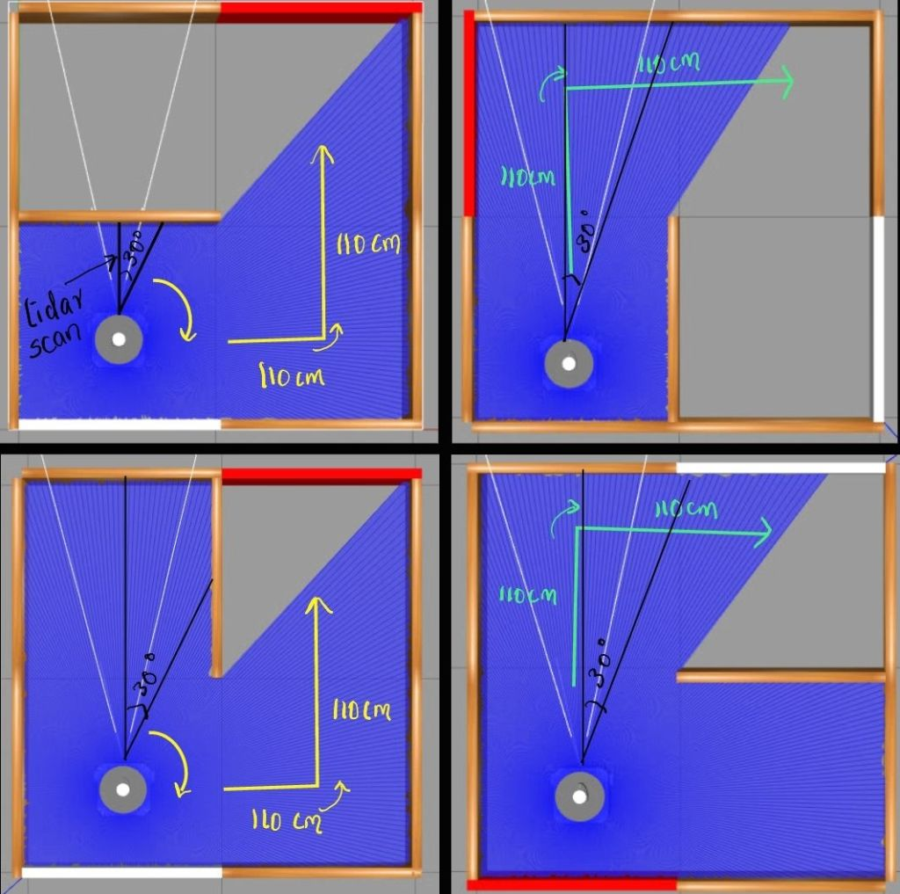
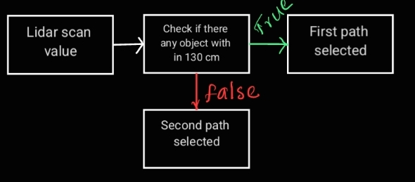
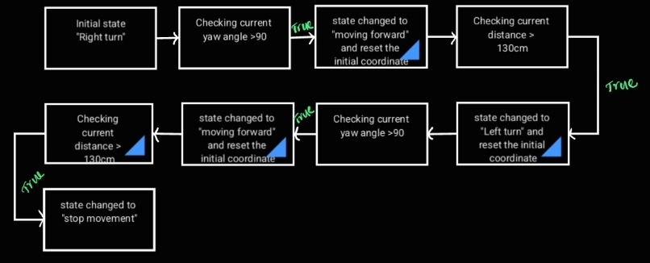
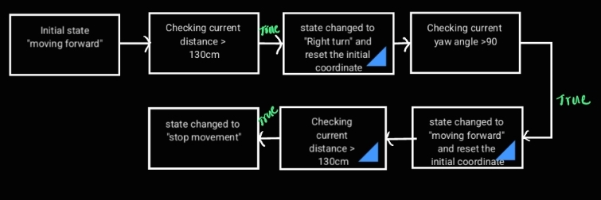

# Challenge 4

Goal is to drive to the right most corner of the maze from the bottom left corner. Mazes are in four patterns.

## Approach

- To tackle this challenge, we utilize both the Lidar scan values and odometry data. 
- The robot performs two main types of movements to navigate the maze, relying on odometry data as in previous challenges.

- The decision on which motion to choose is determined based on the Lidar scan values.

- In the above diagram, the yellow path represents the first type of motion, while the green path represents the second type of motion.

1. First motion:  Turn 90 degree right , moving forward for 110cm , turn 90 degree left, move forward for 110 cm and stop

2. second motion: Moving forward for 110cm , turn 90 degree right, move forward for 110 cm and stop.

- To solve the maze using Lidar values, the robot scans both the forward distance and a 30-degree angled distance to the right side. The robot is assumed to be placed in the bottom-left side of the maze.

- If any object is detected within a range of 130 cm using the Lidar data, the robot will choose the first path to solve the maze. Otherwise, it will choose the second path.

- A state machine is employed to manage the robot's motion, transitioning between states as needed for the appropriate actions.

## Algorithm

### First path

### Second path

## Result 
The movement pattern of the robot has been successfully executed.
Challenges have completed and this is my Git Repo:[Link](https://mygit.th-deg.de/sg27251/robot_ptogramming_ws2023.git)

## Challenges faced

- The use of a state machine became somewhat complex due to the multiple movements involved in navigating the maze.

- In a physical robot setup, Lidar values were inconsistent and varied depending on the robot's battery power. Additionally, errors in odometry values, particularly in orientation, were observed due to the malfunction of the compass inside the robot.

- To mitigate these issues, testing was conducted with multiple robots rather than relying on a single robot. This approach helped to address the variability in Lidar values and odometry errors.